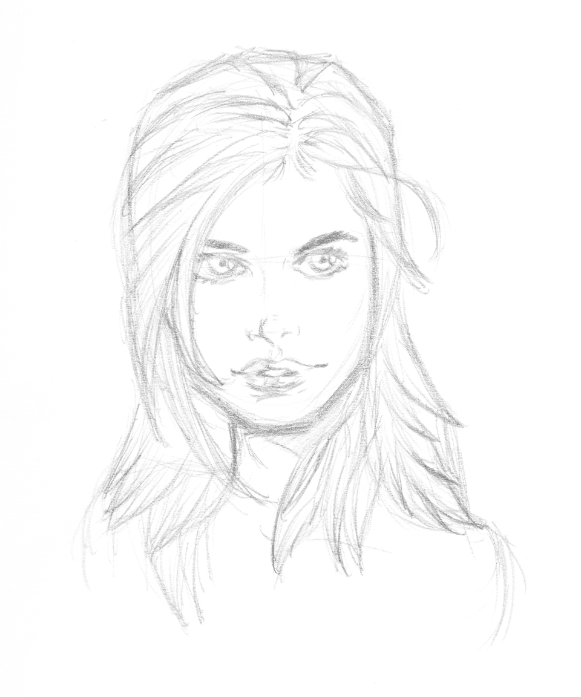
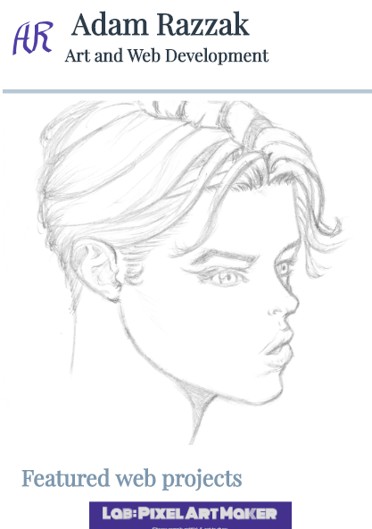
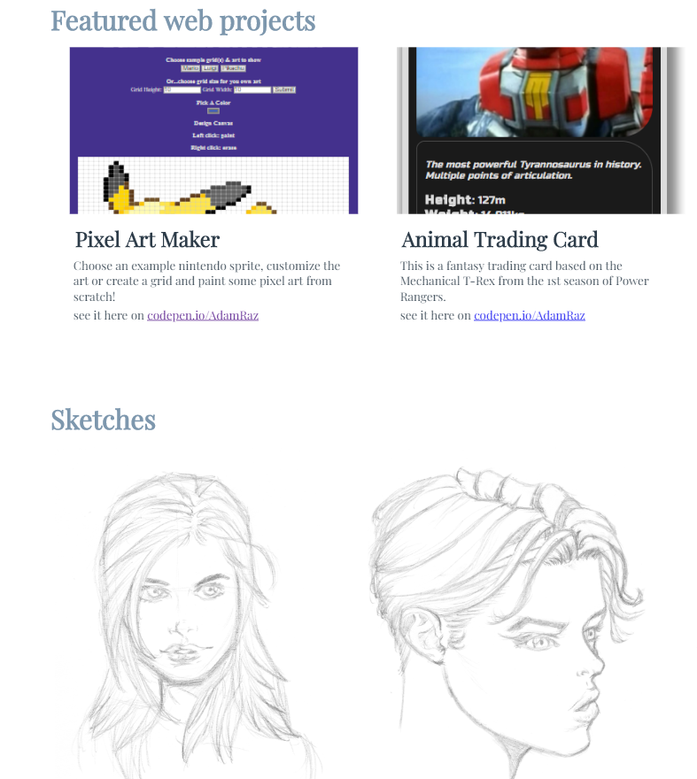

# Adam Razzak's portfolio page
My personal art and web development porfolio

The page is responsive, made with grid and flexbox based layouts, media queries, calculated font sizes and can display multiple image resolutions/sizes depending on device.

**see the live page at this github pages link**: https://adamraz.github.io/adam-portfolio-page/

## responsive code examples

### Image sourcing
```html

```

### variable font size
```css
p {
  font-size: calc(16px + 0.1vw);
  overflow-wrap: break-word;
  /* wrap to handle long URLs */
}
```
vw reprsents viewport width, 0.1vw is 0.1% of the width of the viewport, see https://css-tricks.com/viewport-sized-typography/

### grid layout (for logo and page title)
```css
.intro {
  width: 100%;
  height: 15vh;
  display: grid;
  grid-template-columns: 1fr 5fr;
  grid-template-rows: 1fr 1fr;
}

.logo {
  width: 65%;
  height: 65%;
  grid-column-start: 1;
  grid-row-start: 1;
  grid-row-end: 3;
  padding: 15px;
}
```

### flex wrap (for gallery images)
```css
.projects, .sketches {
  display: flex;
  flex-wrap: wrap;
  width: 90%;
  margin: 0 auto;
}
```

### media queries
To apply different styles for different device screens
```css
@media screen and (min-device-width: 480px) {
  .project-container {
    width: 60%;
    margin: 10px auto;
  }
```

## authors

* **Adam Razzak** - all sketches are by me as well!

## acknowledgments

* Udacity course and people! see https://eu.udacity.com/course/front-end-web-developer-nanodegree--nd001

## project preview:

app screens:

* mobile view



* ipad view



* desktop view
see the live link: https://adamraz.github.io/adam-portfolio-page/
